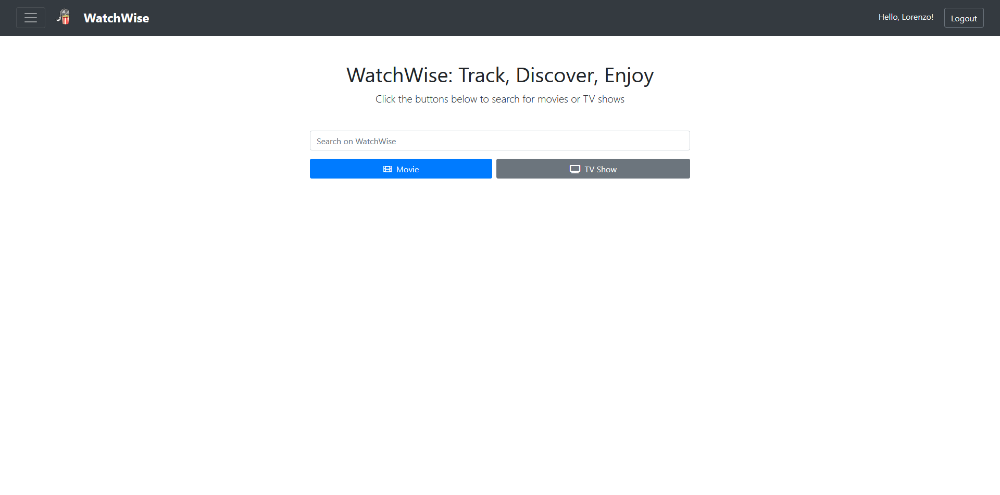
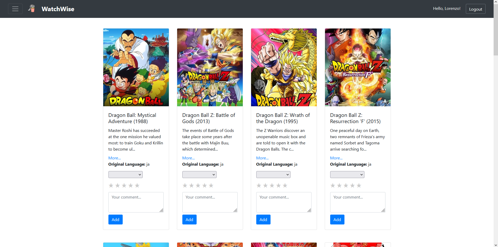
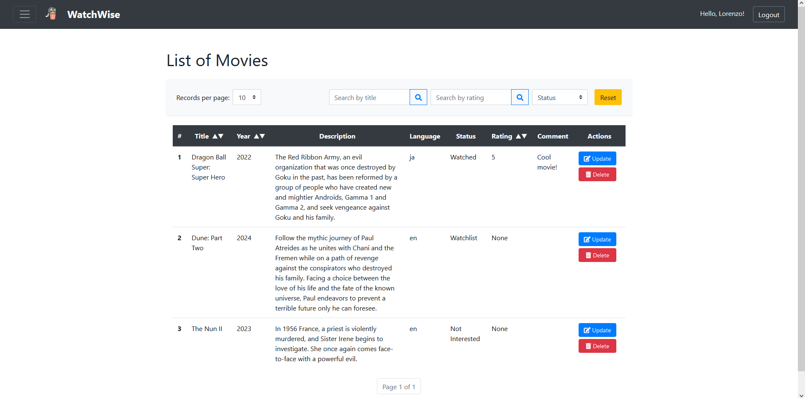
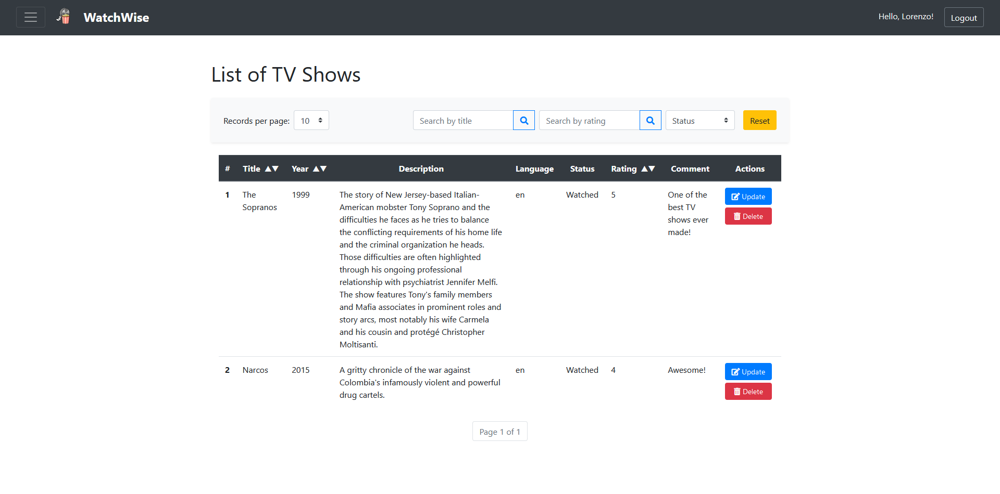
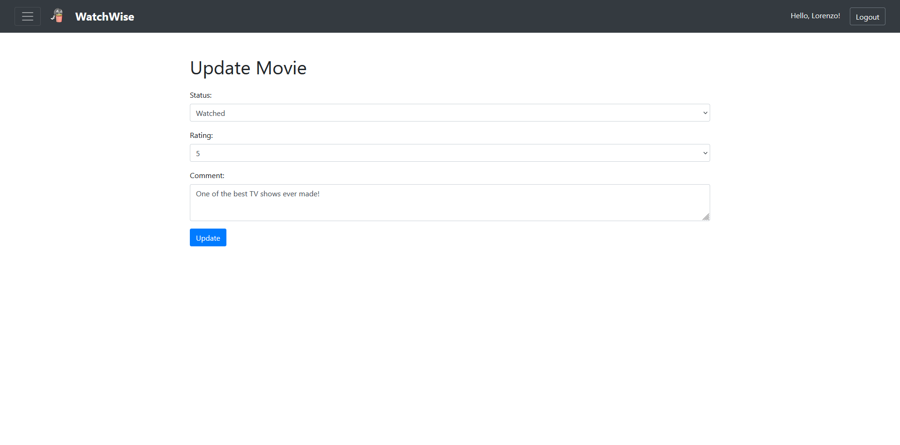
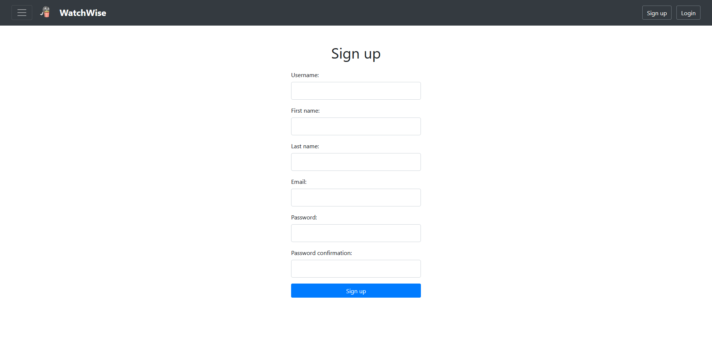
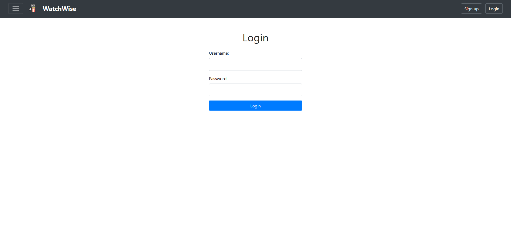

# WatchWise Project Documentation

## Overview

WatchWise is a full-stack project designed for tracking movies and TV shows. It is developed using Django/Python for the backend and HTML/CSS/Bootstrap/JavaScript for the frontend.

The application aims to assist users in navigating the TMDB (The Movie Database), a very popular public media database. It offers numerous functionalities, including saving TV shows and movies into the database along with preferences and comments, filtering records by name and list type, updating and deleting entries, and much more.

## Features

- **Media Tracking:** Save and manage a list of your favorite movies and TV shows.
- **User Interactions:** Add comments and personal ratings.
- **Dynamic Filtering:** Search and filter media based on different criteria.

## Prerequisites

- Python 3.8 or later
- TMDB API Key
- Git

## Project Setup

Follow these steps to set up the project:

### **Step 1**: Clone the project

```sh
git clone https://github.com/lucchesilorenzo/watchwise.git
```

### **Step 2**: Navigate to the directory

```sh
cd watchwise
code .
```

### **Step 3**: Create and activate a virtual environment

```sh
python -m venv .venv

# Activate for MacOS & Linux
source .venv/bin/activate

# Activate for Windows (Git Bash)
source .venv/Scripts/activate
```

### **Step 4**: Install dependencies

```sh
pip install -r requirements.txt
```

### **Step 5**: Migrate the database and create a superuser

```sh
cd watchwise_project
python manage.py migrate
python manage.py createsuperuser
```

### **Step 6**: Run the server

```sh
python manage.py runserver
```

### **Step 7**: Go to http://127.0.0.1:8000/watchwise/

## Screenshots

### Homepage:


### Results:


### List of Movies:


### List of TV Shows:


### Update Media:


### Sign up:


### Login:



## Future Plans

- Enhance the front-end experience by adopting a robust framework such as React or Angular.
- Introduce additional API endpoints to display currently popular movies and TV shows.
- Host the web application on a cloud service.

## References

[TMDB API Documentation](https://developer.themoviedb.org/reference/intro/getting-started)

## Team

- Lorenzo Lucchesi
- Gianni Jin
